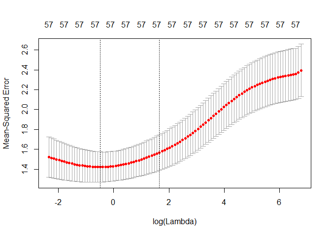
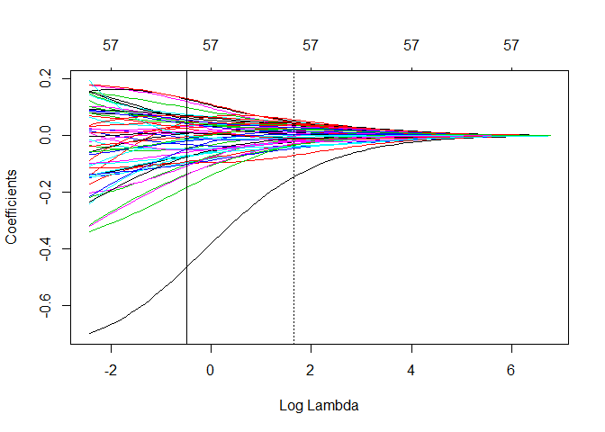

Shrinkage methods
=================

*Evalyne Muiruri* *November 2018*

AIM: To demonstrate the use of glmnet and glmmLasso to perform ridge and lasso regression

Our original dataset had 72 predictors but for simplicity, I focus only on the numeric variables in the dataframe: **numd**

``` r
str(numd)
```

    ## 'data.frame':    666 obs. of  57 variables:
    ##  $ HaulDur_min     : int  30 29 30 30 30 31 30 30 30 30 ...
    ##  $ ShootLat_degdec : num  51.7 51.5 51.5 52 52 ...
    ##  $ ShootLong_degdec: num  1.73 1.33 1.38 1.59 1.58 ...
    ##  $ Depth_m         : num  29 19.9 18.5 16.9 17.7 14.3 20.1 30.3 21 19.1 ...
    ##  $ year            : num  2018 2009 2009 2009 2009 ...
    ##  $ z_emod          : num  -29 -11.2 -13.6 -15 -16.8 -11.8 -18.8 -31.2 -13 -22 ...
    ##  $ sl_emod         : num  0.218 0.317 0.051 0.019 0.158 0.403 0.115 0.474 0.342 0.203 ...
    ##  $ z_ma            : num  -29.1 -11.1 -13.6 -15 -16.6 ...
    ##  $ sl_ma           : num  0.213 0.214 0.045 0.011 0.126 0.328 0.113 0.387 0.375 0.119 ...
    ##  $ vrm5_ma         : num  0.839 0.542 0.782 0.652 0.803 0.871 0.895 0.859 0.849 0.797 ...
    ##  $ vrm10_ma        : num  0.839 0.542 0.782 0.652 0.803 0.871 0.895 0.859 0.849 0.797 ...
    ##  $ tri_ma          : num  0.513 0.741 0.115 0.095 0.689 ...
    ##  $ wexp_ma         : num  1.059 1.008 0.992 1.056 0.99 ...
    ##  $ posop_ma        : num  0.009 0.034 0.013 0.008 0.005 0.218 0.037 0.003 0.02 0.003 ...
    ##  $ negop_ma        : num  0.004 0.011 0.014 0.021 0.031 ...
    ##  $ closedDs_ma     : num  0 0 0 0.686 3.853 ...
    ##  $ ChBaseLevel_ma  : num  -31.5 -13.3 -14.3 -14.2 -13.6 ...
    ##  $ valleyD_ma      : num  8.92 6.01 3.77 5.43 2.22 ...
    ##  $ relSlP_ma       : num  0.113 0.276 0.152 0 0.098 0.802 0.284 0.078 0.698 0.011 ...
    ##  $ currVel         : num  0.624 0.626 0.59 0.616 0.744 0.571 0.688 0.793 0.493 0.612 ...
    ##  $ waveVel         : num  0.191 0.37 0.32 0.441 0.37 0.627 0.396 0.218 0.977 0.162 ...
    ##  $ cdist           : num  0.389 0.085 0.119 0.113 0.034 0.055 0.072 0.333 0.028 0.218 ...
    ##  $ sub_gravel      : num  0.029 0.009 0.01 0.067 0.053 0.002 0.048 0.312 0 0.047 ...
    ##  $ sub_mud         : num  0.015 0.021 0.004 0.03 0.007 0.021 0 0.092 0.002 0.024 ...
    ##  $ sub_sand        : num  0.956 0.97 0.986 0.903 0.941 0.977 0.952 0.596 0.998 0.929 ...
    ##  $ gst_cur_u       : num  NA 0.192 0.17 0.034 NA NA NA 0.126 NA 0.07 ...
    ##  $ gst_cur_v       : num  NA -0.028 0.139 0.265 NA NA NA 0.101 NA 0.082 ...
    ##  $ gst_cur_uv      : num  NA 0.194 0.22 0.267 NA NA NA 0.161 NA 0.108 ...
    ##  $ mix_layer_th    : num  29.4 10.3 9.9 10.4 9.9 ...
    ##  $ chla_m          : num  NA 3.82 3.74 5.32 NA ...
    ##  $ chla_s          : num  3.91 3.68 3.87 4.34 4.32 ...
    ##  $ o_prod_m        : num  1081 4889 5047 5184 5803 ...
    ##  $ o_prod_s        : num  1206 4574 4531 4749 5043 ...
    ##  $ phytopl         : num  2.96 108.2 105 90.42 88.54 ...
    ##  $ salinity_b      : num  35.1 34.5 34.5 34.6 34.7 ...
    ##  $ salinity_s      : num  35.1 34.4 34.4 34.6 34.7 ...
    ##  $ temp_b          : num  8.83 290.97 290.97 291.52 291.52 ...
    ##  $ sst_Modis       : num  NA 17.2 17.1 17.5 17.6 ...
    ##  $ sst_Modis_snl   : num  NA 17.5 17.5 17.7 17.6 ...
    ##  $ sst_fronts_snl  : num  NA 22380 24907 69337 80218 ...
    ##  $ small_fronts_snl: num  NA 17.5 17.5 17.7 17.6 ...
    ##  $ hotsp_fronts_snl: num  NA 8610 4963 0 1230 ...
    ##  $ chla_fronts_snl : num  NA 0 0 0 0 ...
    ##  $ gst_u_clim      : num  -0.02 -0.073 -0.083 -0.013 NA NA NA 0.023 NA -0.083 ...
    ##  $ gst_v_clim      : num  0.075 0.08 0.081 0.062 NA NA NA 0.001 NA 0.081 ...
    ##  $ gst_uv_clim     : num  0.203 0.259 0.205 0.159 NA NA NA 0.089 NA 0.205 ...
    ##  $ mix_layer_clim  : num  29.34 11.04 9.82 10.49 9.8 ...
    ##  $ chla_clim       : num  2.87 3.92 3.35 4.38 5.03 ...
    ##  $ oceanp_clim     : num  847 5008 4797 5118 5449 ...
    ##  $ pic_clim        : num  NA 0.009 0.008 0.007 NA NA NA 0.004 0.002 0.008 ...
    ##  $ poc_clim        : num  284 364 346 388 422 ...
    ##  $ phytopl_clim    : num  18.2 117.2 102.6 80.1 78.6 ...
    ##  $ sal_b_clim      : num  35 34.5 34.5 34.6 34.6 ...
    ##  $ sal_s_clim      : num  35.1 34.9 34.9 34.9 34.9 ...
    ##  $ sst_copcs_clim  : num  8.91 18.01 17.86 18.2 17.82 ...
    ##  $ sst_modis_clim  : num  7.75 17.39 17.25 17.71 17.86 ...
    ##  $ DensAbund_N_Sqkm: num  93.2 132.2 423.3 231.4 66.9 ...

``` r
library(ggplot2)
```

Note some polynomial variables. e.g. phytopl\_clim

``` r
phytoplot <- qplot(numd$phytopl_clim, log(numd$DensAbund_N_Sqkm), geom=c("point", "smooth")) + 
    geom_smooth(method="lm", colour="red") + theme_classic() 
phytoplot + stat_smooth(method="lm", se=TRUE, formula=y ~ poly(x, 2, raw=TRUE),colour="green3", fill="green3", linetype="dashed") #' Show second order polynomial
```


Add second order term to dataset

``` r
numd$phytopl_clim_poly <- I(numd$phytopl_clim^2)
```

**Using glmnet**
================

<https://cran.r-project.org/web/packages/glmnet/index.html>

``` r
#install.packages("glmnet", "glmnetUtils")
library(glmnet); library(glmnetUtils)
```

Use glmnetUtils for simpler model specification. For both ridge and lasso regression, we need to standardize our variables so they're all to the same scale.

``` r
numd.sc <- (data.frame(scale(numd, center=TRUE, scale=TRUE)))
numd.sc$DensAbund_N_Sqkm <- numd$DensAbund_N_Sqkm

str(numd.sc)
```

    ## 'data.frame':    666 obs. of  58 variables:
    ##  $ HaulDur_min      : num  0.46 0.345 0.46 0.46 0.46 ...
    ##  $ ShootLat_degdec  : num  -0.1986 -0.3536 -0.327 -0.069 -0.0135 ...
    ##  $ ShootLong_degdec : num  0.385 0.274 0.287 0.345 0.342 ...
    ##  $ Depth_m          : num  0.164 -0.388 -0.474 -0.571 -0.522 ...
    ##  $ year             : num  2.12 -1 -1 -1 -1 ...
    ##  $ z_emod           : num  -0.356 0.723 0.577 0.492 0.383 ...
    ##  $ sl_emod          : num  -0.0104 0.2582 -0.4635 -0.5504 -0.1732 ...
    ##  $ z_ma             : num  -0.414 0.755 0.594 0.504 0.399 ...
    ##  $ sl_ma            : num  0.0837 0.087 -0.469 -0.5809 -0.2025 ...
    ##  $ vrm5_ma          : num  0.7523 -0.4888 0.5141 -0.0292 0.6018 ...
    ##  $ vrm10_ma         : num  0.7523 -0.4888 0.5141 -0.0292 0.6018 ...
    ##  $ tri_ma           : num  -0.0968 0.1011 -0.4424 -0.4598 0.056 ...
    ##  $ wexp_ma          : num  0.233 -0.307 -0.476 0.202 -0.497 ...
    ##  $ posop_ma         : num  -0.402 -0.186 -0.368 -0.411 -0.437 ...
    ##  $ negop_ma         : num  -0.367 -0.339 -0.327 -0.299 -0.259 ...
    ##  $ closedDs_ma      : num  -0.3015 -0.3015 -0.3015 -0.0909 0.881 ...
    ##  $ ChBaseLevel_ma   : num  -0.465 0.79 0.722 0.727 0.772 ...
    ##  $ valleyD_ma       : num  0.6798 0.0877 -0.3692 -0.0311 -0.6849 ...
    ##  $ relSlP_ma        : num  -0.681 -0.188 -0.563 -1.022 -0.726 ...
    ##  $ currVel          : num  0.594 0.604 0.412 0.551 1.234 ...
    ##  $ waveVel          : num  -1.031 -0.486 -0.638 -0.269 -0.486 ...
    ##  $ cdist            : num  0.99 -0.375 -0.223 -0.25 -0.604 ...
    ##  $ sub_gravel       : num  -0.0554 -0.4548 -0.4349 0.7035 0.4239 ...
    ##  $ sub_mud          : num  -0.319 -0.277 -0.397 -0.214 -0.376 ...
    ##  $ sub_sand         : num  0.3346 0.4318 0.543 -0.0336 0.2304 ...
    ##  $ gst_cur_u        : num  NA 2.09 1.873 0.528 NA ...
    ##  $ gst_cur_v        : num  NA -0.4 0.815 1.732 NA ...
    ##  $ gst_cur_uv       : num  NA 0.54 0.764 1.169 NA ...
    ##  $ mix_layer_th     : num  0.562 -0.838 -0.868 -0.831 -0.868 ...
    ##  $ chla_m           : num  NA 0.00247 -0.04054 0.84918 NA ...
    ##  $ chla_s           : num  0.188 0.012 0.158 0.506 0.492 ...
    ##  $ o_prod_m         : num  -1.38 0.983 1.081 1.167 1.55 ...
    ##  $ o_prod_s         : num  -1.256 0.8 0.773 0.906 1.085 ...
    ##  $ phytopl          : num  -1.431 1.298 1.215 0.837 0.788 ...
    ##  $ salinity_b       : num  1.009 0.462 0.462 0.589 0.611 ...
    ##  $ salinity_s       : num  0.782 0.343 0.343 0.508 0.523 ...
    ##  $ temp_b           : num  -1.399 0.767 0.767 0.771 0.771 ...
    ##  $ sst_Modis        : num  NA 0.533 0.496 0.594 0.611 ...
    ##  $ sst_Modis_snl    : num  NA 0.651 0.633 0.677 0.667 ...
    ##  $ sst_fronts_snl   : num  NA -0.7445 -0.6995 0.0918 0.2856 ...
    ##  $ small_fronts_snl : num  NA 0.651 0.633 0.677 0.667 ...
    ##  $ hotsp_fronts_snl : num  NA -0.369 -0.404 -0.45 -0.439 ...
    ##  $ chla_fronts_snl  : num  NA -0.184 -0.184 -0.184 -0.184 ...
    ##  $ gst_u_clim       : num  -0.356 -1.718 -1.975 -0.176 NA ...
    ##  $ gst_v_clim       : num  0.906 1.021 1.045 0.606 NA ...
    ##  $ gst_uv_clim      : num  1.177 2.04 1.208 0.498 NA ...
    ##  $ mix_layer_clim   : num  0.601 -0.798 -0.892 -0.841 -0.894 ...
    ##  $ chla_clim        : num  -0.671 0.0625 -0.3387 0.3898 0.8473 ...
    ##  $ oceanp_clim      : num  -1.526 1.01 0.881 1.076 1.278 ...
    ##  $ pic_clim         : num  NA 1.057 0.713 0.368 NA ...
    ##  $ poc_clim         : num  -0.941 -0.336 -0.472 -0.158 0.102 ...
    ##  $ phytopl_clim     : num  -1.239 2.223 1.714 0.925 0.873 ...
    ##  $ sal_b_clim       : num  0.92 0.513 0.513 0.561 0.564 ...
    ##  $ sal_s_clim       : num  0.653 0.569 0.577 0.584 0.584 ...
    ##  $ sst_copcs_clim   : num  -1.41 0.728 0.691 0.771 0.682 ...
    ##  $ sst_modis_clim   : num  -1.59 0.495 0.464 0.564 0.595 ...
    ##  $ DensAbund_N_Sqkm : num  93.2 132.2 423.3 231.4 66.9 ...
    ##  $ phytopl_clim_poly: num  -0.963 2.875 1.959 0.779 0.712 ...

Our response variable is **DensAbund\_N\_Sqkm**. It is heavily skewed and but we could try a log transformation in our models.

``` r
par(mfrow=c(1,2))
hist(numd.sc$DensAbund_N_Sqkm, main="Density")
hist(log(numd.sc$DensAbund_N_Sqkm), main="log(Density)")
```


### **Ridge Regression**

We can fit a ridge regression model with the glmnet() function. This call automatically picks a range of lambda values to try and compute coefficients for each predictor for each of these lambda values. alpha=0 is used to specify that we want to fit a ridge regression model

``` r
ridgefit1 <- glmnet(log(DensAbund_N_Sqkm) ~ ., data=numd.sc, alpha=0, family="gaussian")
plot.glmnet(ridgefit1, "lambda")
```


Let's call our model formula **form**

``` r
form <- as.formula("log(DensAbund_N_Sqkm) ~ .")
```

The function cv.glmnet() performs k-fold cross-validation to pick a lambda value. nfolds specifies the number of folds to fit.

``` r
ridgefit1.cv <- cv.glmnet(form, data=numd.sc, family="gaussian", alpha=0, nfolds=10)
```

plot.cv.glmnet() plots the cross validation error (in this case mean squared error) for each value of log(lambda). The vertical lines show the log(lambda) value that yields the minimum cross validation error (i.e. lambda.min) and, the log(lambda) 1 standard error away from lambda.min (i.e. lambda.1se)

``` r
plot.cv.glmnet(ridgefit1.cv) 
```



We can re-draw the final trace plot with lambda.min indicated as a solid line and lambda.1se as a dotted line

``` r
plot(ridgefit1.cv$glmnet.fit , "lambda") 
abline(v=log(ridgefit1.cv$lambda.min))
abline(v=log(ridgefit1.cv$lambda.1se), lty=3)
```



*lambda.1se is a lot more conservative and is sometimes recommended for use over lambda.min where model stability is an issue (e.g. due to low sample size)* *See <http://www.sthda.com/english/wiki/line-types-in-r-lty> and <https://web.stanford.edu/~hastie/ElemStatLearn//> for further discussion.*

Note however, that the results of cv.glmnet are random, since the folds are selected at random. We can reduce this randomness by running cv.glmnet many times e.g with the function below

``` r
cvboot <- function(y, dataset, form, fam, reps, vars, alpha){
  reps=reps # no. of iterations
  lambdas <- matrix(NA, reps, 2) # create matrix to store lambdas picked by cross validation below
  for(i in 1:reps){ 
    cv.fit <- cv.glmnet(form, data=dataset,
                        family=fam,
                        nfolds=10, alpha=alpha)
    #print(plot.cv.glmnet(cv.fit))
    lambdas[i,] <- c(cv.fit$lambda.min, cv.fit$lambda.1se)
  }
    output <- data.frame(cbind(lambdas))
    names(output) <- c("lambda.min", "lambda.1se")
    output
}
```

After repeating cross validation, we see that lambda.min is within a small range.

``` r
ridgecvi <- cvboot(dataset=numd.sc, form=form, fam="gaussian", reps=100, vars=names(numd.sc[-57]), alpha=0)
hist(ridgecvi$lambda.min) 
```


``` r
(optridgeL <- mean(ridgecvi$lambda.min))
```

    ## [1] 0.5428267

We can extract fitted values using predict()

``` r
head(predict(ridgefit1, s=optridgeL, newdata=numd.sc))
```

    ##             1
    ## [1,] 6.052629
    ## [2,] 5.785555
    ## [3,] 5.660598
    ## [4,] 4.554142
    ## [5,] 5.612020
    ## [6,] 5.491535

We can also extract the coefficients and for this optimal lambda. Note the large intercept value (~5) in comparison to the small coefficients for the predictors

``` r
plot(coef(ridgefit1, s=optridgeL)); abline(h=0)
```


### **Lasso Regression**

In glmnet the operations are identical with only one exception. We need to specify *alpha=1* in our call

``` r
lassofit1 <- glmnet(log(DensAbund_N_Sqkm) ~ ., data=numd.sc, alpha=1, family="gaussian")
plot(lassofit1, "lambda")
```


``` r
form <- as.formula("log(DensAbund_N_Sqkm) ~ .")
```

As before we need cross validation to pick a good lambda value

``` r
lassofit1.cv <- cv.glmnet(form, data=numd.sc, 
                          family="gaussian", alpha=1, nfolds=10)
plot(lassofit1.cv)
```


``` r
log(lassofit1.cv$lambda.min)
```

    ## [1] -2.647859

Trace plots for cross validation with our cross validated lambdas added (lambda.min = solid line, lambda.2se = dotted line)

``` r
plot(lassofit1.cv$glmnet.fit , "lambda") 
abline(v=log(lassofit1.cv$lambda.min))
abline(v=log(lassofit1.cv$lambda.1se), lty=3)
```


As with ridge we can repeat our cross validation using the same function written above.

``` r
lassocvi <- cvboot(dataset=numd.sc, form=form, fam="gaussian", reps=100, vars=names(numd.sc[-57]), alpha=1)
par(mfrow=c(1,2))
hist(lassocvi$lambda.min) 
hist(lassocvi$lambda.1se) 
```


Now we can see that our lambda value with minimum cross validation error is variable and uncentred. This could be a good case to use the lambda.1se instead as discussed earlier. In an ideal scenario, we would holdout a portion of the data for all cross validation and possibly choose a lambda value on the model with the least error. (This could be measured as mean squared error or with some other metric)

For simplicity, I'll stick with lambda.min

``` r
(optlassoL <- mean(lassocvi$lambda.min))
```

    ## [1] 0.0696578

``` r
(optlassoLSE <- mean(lassocvi$lambda.1se))
```

    ## [1] 0.273607

We can extract fitted values using predict()

``` r
head(predict(ridgefit1, s=optlassoL, newdata=numd.sc))
```

    ##             1
    ## [1,] 5.969615
    ## [2,] 5.742548
    ## [3,] 5.659812
    ## [4,] 4.265122
    ## [5,] 5.510013
    ## [6,] 5.448832

We can also extract the coefficients and for this optimal lambda.

``` r
par(mfrow=c(1,3))
plot(coef(ridgefit1, s=optlassoL), main="Ridge Regression", ylab="Coefficients (Beta)"); abline(h=0)
plot(coef(lassofit1, s=optlassoL), main="Lasso Regression_lambda.min", ylab="Coefficients (Beta)"); abline(h=0)
plot(coef(lassofit1, s=optlassoLSE), main="Lasso Regression_lambda 1se", ylab="Coefficients (Beta)"); abline(h=0)
```


``` r
par(mfrow=c(1,1))
```

But note we cannot obtain ordinary lm() or lmer() outputs with summary() calls.

``` r
summary(lassofit1)
```

    ##                 Length Class     Mode     
    ## a0                81   -none-    numeric  
    ## beta            4617   dgCMatrix S4       
    ## df                81   -none-    numeric  
    ## dim                2   -none-    numeric  
    ## lambda            81   -none-    numeric  
    ## dev.ratio         81   -none-    numeric  
    ## nulldev            1   -none-    numeric  
    ## npasses            1   -none-    numeric  
    ## jerr               1   -none-    numeric  
    ## offset             1   -none-    logical  
    ## call               5   -none-    call     
    ## nobs               1   -none-    numeric  
    ## terms              2   -none-    call     
    ## xlev              57   -none-    list     
    ## alpha              1   -none-    numeric  
    ## sparse             1   -none-    logical  
    ## use.model.frame    1   -none-    logical  
    ## na.action          1   -none-    character

``` r
summary(lassofit1.cv)
```

    ##                 Length Class  Mode     
    ## lambda          81     -none- numeric  
    ## cvm             81     -none- numeric  
    ## cvsd            81     -none- numeric  
    ## cvup            81     -none- numeric  
    ## cvlo            81     -none- numeric  
    ## nzero           81     -none- numeric  
    ## name             1     -none- character
    ## glmnet.fit      12     elnet  list     
    ## lambda.min       1     -none- numeric  
    ## lambda.1se       1     -none- numeric  
    ## call             6     -none- call     
    ## terms            2     -none- call     
    ## xlev            57     -none- list     
    ## alpha            1     -none- numeric  
    ## nfolds           1     -none- numeric  
    ## sparse           1     -none- logical  
    ## use.model.frame  1     -none- logical  
    ## na.action        1     -none- character

``` r
summary(lassofit1.cv$glmnet.fit)
```

    ##           Length Class     Mode   
    ## a0          81   -none-    numeric
    ## beta      4617   dgCMatrix S4     
    ## df          81   -none-    numeric
    ## dim          2   -none-    numeric
    ## lambda      81   -none-    numeric
    ## dev.ratio   81   -none-    numeric
    ## nulldev      1   -none-    numeric
    ## npasses      1   -none-    numeric
    ## jerr         1   -none-    numeric
    ## offset       1   -none-    logical
    ## call         7   -none-    call   
    ## nobs         1   -none-    numeric

``` r
head(print(lassofit1.cv$glmnet.fit))
```

    ## 
    ## Call:  glmnet(x = xy$x, y = xy$y, weights = xy$weights, offset = xy$offset,      alpha = alpha, family = "gaussian") 
    ## 
    ##       Df    %Dev    Lambda
    ##  [1,]  0 0.00000 0.8729000
    ##  [2,]  1 0.05451 0.7953000
    ##  [3,]  1 0.09977 0.7247000
    ##  [4,]  2 0.14540 0.6603000
    ##  [5,]  2 0.19250 0.6016000
    ##  [6,]  2 0.23150 0.5482000
    ##  [7,]  2 0.26390 0.4995000
    ##  [8,]  2 0.29080 0.4551000
    ##  [9,]  2 0.31320 0.4147000
    ## [10,]  3 0.33560 0.3779000
    ## [11,]  3 0.35560 0.3443000
    ## [12,]  4 0.37230 0.3137000
    ## [13,]  4 0.38620 0.2858000
    ## [14,]  5 0.39940 0.2604000
    ## [15,]  4 0.41030 0.2373000
    ## [16,]  4 0.41940 0.2162000
    ## [17,]  4 0.42690 0.1970000
    ## [18,]  5 0.43340 0.1795000
    ## [19,]  7 0.43910 0.1636000
    ## [20,]  7 0.44550 0.1490000
    ## [21,] 10 0.45500 0.1358000
    ## [22,] 12 0.46780 0.1237000
    ## [23,] 13 0.48020 0.1127000
    ## [24,] 13 0.49070 0.1027000
    ## [25,] 14 0.49990 0.0936000
    ## [26,] 15 0.50800 0.0852800
    ## [27,] 16 0.51470 0.0777100
    ## [28,] 20 0.52120 0.0708000
    ## [29,] 21 0.52840 0.0645100
    ## [30,] 22 0.53510 0.0587800
    ## [31,] 23 0.54110 0.0535600
    ## [32,] 25 0.54680 0.0488000
    ## [33,] 25 0.55220 0.0444700
    ## [34,] 26 0.55670 0.0405200
    ## [35,] 31 0.56170 0.0369200
    ## [36,] 31 0.56780 0.0336400
    ## [37,] 31 0.57300 0.0306500
    ## [38,] 31 0.57720 0.0279300
    ## [39,] 32 0.58080 0.0254500
    ## [40,] 34 0.58380 0.0231800
    ## [41,] 34 0.58660 0.0211300
    ## [42,] 36 0.58900 0.0192500
    ## [43,] 39 0.59180 0.0175400
    ## [44,] 39 0.59740 0.0159800
    ## [45,] 40 0.60270 0.0145600
    ## [46,] 38 0.60690 0.0132700
    ## [47,] 38 0.61030 0.0120900
    ## [48,] 39 0.61310 0.0110100
    ## [49,] 40 0.61560 0.0100400
    ## [50,] 43 0.61840 0.0091450
    ## [51,] 43 0.62120 0.0083320
    ## [52,] 43 0.62360 0.0075920
    ## [53,] 45 0.62550 0.0069170
    ## [54,] 45 0.62890 0.0063030
    ## [55,] 46 0.63170 0.0057430
    ## [56,] 46 0.63400 0.0052330
    ## [57,] 46 0.63600 0.0047680
    ## [58,] 47 0.63770 0.0043440
    ## [59,] 47 0.63910 0.0039580
    ## [60,] 47 0.64030 0.0036070
    ## [61,] 46 0.64130 0.0032860
    ## [62,] 46 0.64210 0.0029940
    ## [63,] 46 0.64270 0.0027280
    ## [64,] 48 0.64330 0.0024860
    ## [65,] 48 0.64390 0.0022650
    ## [66,] 49 0.64450 0.0020640
    ## [67,] 51 0.64510 0.0018810
    ## [68,] 51 0.64560 0.0017140
    ## [69,] 51 0.64600 0.0015610
    ## [70,] 51 0.64640 0.0014230
    ## [71,] 53 0.64670 0.0012960
    ## [72,] 54 0.64690 0.0011810
    ## [73,] 54 0.64710 0.0010760
    ## [74,] 54 0.64730 0.0009805
    ## [75,] 55 0.64740 0.0008934
    ## [76,] 55 0.64750 0.0008141
    ## [77,] 55 0.64760 0.0007417
    ## [78,] 55 0.64770 0.0006758
    ## [79,] 55 0.64770 0.0006158
    ## [80,] 55 0.64780 0.0005611
    ## [81,] 55 0.64780 0.0005113

    ##      Df    %Dev Lambda
    ## [1,]  0 0.00000 0.8729
    ## [2,]  1 0.05451 0.7953
    ## [3,]  1 0.09977 0.7247
    ## [4,]  2 0.14540 0.6603
    ## [5,]  2 0.19250 0.6016
    ## [6,]  2 0.23150 0.5482

However, glmnet permits a wider variety of operations. e.g. elastic net which combines both the benefits of regularisation and variable selection seen in Lasso but outperforms Lasso where the number of predictors is much higher than the number of observations. Elastic net is also better at kicking out groups of correlated variables.

See *Zou & Hastie (2005) Regularization and variable selection via the Elastic Net* for further details \#\# Mixed Effects Lasso Models with *GLMMLASSO*

For models with random effects, we need the glmmLasso package

``` r
#install.packages("glmmLasso")
library(glmmLasso)
```

Let's use Ship as a random effect

``` r
str(as.factor(cleand$Ship))
```

    ##  Factor w/ 18 levels "58G2","AMAR",..: 8 8 8 8 8 8 8 8 8 8 ...

``` r
numd.sc$Ship <- as.factor(cleand$Ship) # Add our Ship variable to our scaled and centred dataset
```

glmmLasso() will not accept "log(DensAbund\_N\_Sqkm)~." as a formula so we need to write this out explicitly for the model function glmmLasso also doesn't like operators applied to the response (log, sqrt etc)

``` r
predictors <- names(numd.sc[!names(numd.sc) %in% c("DensAbund_N_Sqkm", "Ship")])
numd.sc$logDens <- log(numd.sc$DensAbund_N_Sqkm)
(newformula <- as.formula(paste("logDens ~", paste(predictors, collapse = " + "))))
```

    ## logDens ~ HaulDur_min + ShootLat_degdec + ShootLong_degdec + 
    ##     Depth_m + year + z_emod + sl_emod + z_ma + sl_ma + vrm5_ma + 
    ##     vrm10_ma + tri_ma + wexp_ma + posop_ma + negop_ma + closedDs_ma + 
    ##     ChBaseLevel_ma + valleyD_ma + relSlP_ma + currVel + waveVel + 
    ##     cdist + sub_gravel + sub_mud + sub_sand + gst_cur_u + gst_cur_v + 
    ##     gst_cur_uv + mix_layer_th + chla_m + chla_s + o_prod_m + 
    ##     o_prod_s + phytopl + salinity_b + salinity_s + temp_b + sst_Modis + 
    ##     sst_Modis_snl + sst_fronts_snl + small_fronts_snl + hotsp_fronts_snl + 
    ##     chla_fronts_snl + gst_u_clim + gst_v_clim + gst_uv_clim + 
    ##     mix_layer_clim + chla_clim + oceanp_clim + pic_clim + poc_clim + 
    ##     phytopl_clim + sal_b_clim + sal_s_clim + sst_copcs_clim + 
    ##     sst_modis_clim + phytopl_clim_poly

*NB: In this case we don't have any categorical variables but note again that glmmLasso has another quirk. Categorical variables need to be in the formula as: *"...+ as.factor(variable) + ..."\* \* Unlike glmnet, glmmLasso will not accept NA values and also needs to be supplied with a list of lambda values to try.

``` r
numd.sc2 <- numd.sc[complete.cases(numd.sc),]
```

Try it first without a random effect and just one lambda value Comparing results to glmnet outputs shows they are quite similar

``` r
lassofit2 <- glmmLasso(fix=newformula, rnd =NULL, data=numd.sc2, 
                       family = gaussian(link="identity"), lambda=165,final.re=TRUE)
```

We can overlay the glmmLasso fit with the results of glmnet.

Results seem more comparable to the results with glmnet with lambda.1se

``` r
par(mfrow=c(1,2))
plot(coef(lassofit1, s=optlassoL), main="Lasso Regression_lambda.min", ylab="Coefficients (Beta)"); abline(h=0)
points(coef(lassofit2), col="red",pch=16); abline(h=0)
plot(coef(lassofit1, s=optlassoLSE), main="Lasso Regression_lambda 1se", ylab="Coefficients (Beta)"); abline(h=0)
points(coef(lassofit2), main="Lasso Regression_glmmLasso", ylab="Coefficients (Beta)", col="red",pch=16); abline(h=0)
```


Note that now we can obtain estimates, standard errors and p-values for each predictor:

``` r
summary(lassofit2)
```

    ## Call:
    ## glmmLasso(fix = newformula, rnd = NULL, data = numd.sc2, lambda = 165, 
    ##     family = gaussian(link = "identity"), final.re = TRUE)
    ## 
    ## 
    ## Fixed Effects:
    ## 
    ## Coefficients:
    ##                    Estimate    StdErr z.value   p.value    
    ## (Intercept)        5.233950  0.066667 78.5093 < 2.2e-16 ***
    ## HaulDur_min       -0.775300  0.087700 -8.8404 < 2.2e-16 ***
    ## ShootLat_degdec    0.000000        NA      NA        NA    
    ## ShootLong_degdec   0.000000        NA      NA        NA    
    ## Depth_m            0.000000        NA      NA        NA    
    ## year               0.000000        NA      NA        NA    
    ## z_emod             0.000000        NA      NA        NA    
    ## sl_emod            0.000000        NA      NA        NA    
    ## z_ma               0.000000        NA      NA        NA    
    ## sl_ma              0.000000        NA      NA        NA    
    ## vrm5_ma            0.000000        NA      NA        NA    
    ## vrm10_ma           0.000000        NA      NA        NA    
    ## tri_ma             0.000000        NA      NA        NA    
    ## wexp_ma            0.000000        NA      NA        NA    
    ## posop_ma           0.000000        NA      NA        NA    
    ## negop_ma           0.000000        NA      NA        NA    
    ## closedDs_ma        0.000000        NA      NA        NA    
    ## ChBaseLevel_ma     0.000000        NA      NA        NA    
    ## valleyD_ma         0.000000        NA      NA        NA    
    ## relSlP_ma          0.000000        NA      NA        NA    
    ## currVel            0.000000        NA      NA        NA    
    ## waveVel            0.000000        NA      NA        NA    
    ## cdist              0.000000        NA      NA        NA    
    ## sub_gravel         0.000000        NA      NA        NA    
    ## sub_mud            0.000000        NA      NA        NA    
    ## sub_sand           0.000000        NA      NA        NA    
    ## gst_cur_u          0.000000        NA      NA        NA    
    ## gst_cur_v          0.000000        NA      NA        NA    
    ## gst_cur_uv         0.000000        NA      NA        NA    
    ## mix_layer_th       0.000000        NA      NA        NA    
    ## chla_m             0.000000        NA      NA        NA    
    ## chla_s             0.000000        NA      NA        NA    
    ## o_prod_m           0.000000        NA      NA        NA    
    ## o_prod_s           0.000000        NA      NA        NA    
    ## phytopl            0.000000        NA      NA        NA    
    ## salinity_b         0.000000        NA      NA        NA    
    ## salinity_s         0.000000        NA      NA        NA    
    ## temp_b             0.000000        NA      NA        NA    
    ## sst_Modis          0.000000        NA      NA        NA    
    ## sst_Modis_snl      0.000000        NA      NA        NA    
    ## sst_fronts_snl     0.000000        NA      NA        NA    
    ## small_fronts_snl   0.000000        NA      NA        NA    
    ## hotsp_fronts_snl   0.000000        NA      NA        NA    
    ## chla_fronts_snl    0.000000        NA      NA        NA    
    ## gst_u_clim         0.000000        NA      NA        NA    
    ## gst_v_clim         0.000000        NA      NA        NA    
    ## gst_uv_clim        0.000000        NA      NA        NA    
    ## mix_layer_clim    -0.082895  0.095057 -0.8721    0.3832    
    ## chla_clim          0.000000        NA      NA        NA    
    ## oceanp_clim        0.491488  0.096460  5.0952 3.483e-07 ***
    ## pic_clim           0.000000        NA      NA        NA    
    ## poc_clim           0.000000        NA      NA        NA    
    ## phytopl_clim       0.000000        NA      NA        NA    
    ## sal_b_clim         0.000000        NA      NA        NA    
    ## sal_s_clim         0.000000        NA      NA        NA    
    ## sst_copcs_clim     0.000000        NA      NA        NA    
    ## sst_modis_clim     0.000000        NA      NA        NA    
    ## phytopl_clim_poly  0.000000        NA      NA        NA    
    ## ---
    ## Signif. codes:  0 '***' 0.001 '**' 0.01 '*' 0.05 '.' 0.1 ' ' 1
    ## 
    ## No random effects included!

With *"Ship"* added as a random effect, the coefficients are slightly smaller and fewer variables are picked up

``` r
lassofit3 <- glmmLasso(fix=newformula, rnd =list(Ship=~1), data=numd.sc2, 
                       family = gaussian(link="identity"), lambda=165,final.re=TRUE)
par(mfrow=c(1,2))
plot(coef(lassofit1, s=optlassoL), main="Lasso LMM_lambda.min", ylab="Coefficients (Beta)"); abline(h=0)
points(coef(lassofit3), col="blue",pch=16); abline(h=0)
plot(coef(lassofit1, s=optlassoLSE), main="Lasso LMM_lambda1se", ylab="Coefficients (Beta)"); abline(h=0)
points(coef(lassofit3), col="blue",pch=16); abline(h=0)
```


``` r
summary(lassofit3)
```

    ## Call:
    ## glmmLasso(fix = newformula, rnd = list(Ship = ~1), data = numd.sc2, 
    ##     lambda = 165, family = gaussian(link = "identity"), final.re = TRUE)
    ## 
    ## 
    ## Fixed Effects:
    ## 
    ## Coefficients:
    ##                   Estimate   StdErr z.value   p.value    
    ## (Intercept)        4.90901  0.31486 15.5909 < 2.2e-16 ***
    ## HaulDur_min       -0.43191  0.10980 -3.9336 8.369e-05 ***
    ## ShootLat_degdec    0.00000       NA      NA        NA    
    ## ShootLong_degdec   0.00000       NA      NA        NA    
    ## Depth_m            0.00000       NA      NA        NA    
    ## year               0.00000       NA      NA        NA    
    ## z_emod             0.00000       NA      NA        NA    
    ## sl_emod            0.00000       NA      NA        NA    
    ## z_ma               0.00000       NA      NA        NA    
    ## sl_ma              0.00000       NA      NA        NA    
    ## vrm5_ma            0.00000       NA      NA        NA    
    ## vrm10_ma           0.00000       NA      NA        NA    
    ## tri_ma             0.00000       NA      NA        NA    
    ## wexp_ma            0.00000       NA      NA        NA    
    ## posop_ma           0.00000       NA      NA        NA    
    ## negop_ma           0.00000       NA      NA        NA    
    ## closedDs_ma        0.00000       NA      NA        NA    
    ## ChBaseLevel_ma     0.00000       NA      NA        NA    
    ## valleyD_ma         0.00000       NA      NA        NA    
    ## relSlP_ma          0.00000       NA      NA        NA    
    ## currVel            0.00000       NA      NA        NA    
    ## waveVel            0.00000       NA      NA        NA    
    ## cdist              0.00000       NA      NA        NA    
    ## sub_gravel         0.00000       NA      NA        NA    
    ## sub_mud            0.00000       NA      NA        NA    
    ## sub_sand           0.00000       NA      NA        NA    
    ## gst_cur_u          0.00000       NA      NA        NA    
    ## gst_cur_v          0.00000       NA      NA        NA    
    ## gst_cur_uv         0.00000       NA      NA        NA    
    ## mix_layer_th       0.00000       NA      NA        NA    
    ## chla_m             0.00000       NA      NA        NA    
    ## chla_s             0.00000       NA      NA        NA    
    ## o_prod_m           0.00000       NA      NA        NA    
    ## o_prod_s           0.00000       NA      NA        NA    
    ## phytopl            0.00000       NA      NA        NA    
    ## salinity_b         0.00000       NA      NA        NA    
    ## salinity_s         0.00000       NA      NA        NA    
    ## temp_b             0.00000       NA      NA        NA    
    ## sst_Modis          0.00000       NA      NA        NA    
    ## sst_Modis_snl      0.00000       NA      NA        NA    
    ## sst_fronts_snl     0.00000       NA      NA        NA    
    ## small_fronts_snl   0.00000       NA      NA        NA    
    ## hotsp_fronts_snl   0.00000       NA      NA        NA    
    ## chla_fronts_snl    0.00000       NA      NA        NA    
    ## gst_u_clim         0.00000       NA      NA        NA    
    ## gst_v_clim         0.00000       NA      NA        NA    
    ## gst_uv_clim        0.00000       NA      NA        NA    
    ## mix_layer_clim     0.00000       NA      NA        NA    
    ## chla_clim          0.00000       NA      NA        NA    
    ## oceanp_clim        0.52888  0.10594  4.9924 5.962e-07 ***
    ## pic_clim           0.00000       NA      NA        NA    
    ## poc_clim           0.00000       NA      NA        NA    
    ## phytopl_clim       0.00000       NA      NA        NA    
    ## sal_b_clim         0.00000       NA      NA        NA    
    ## sal_s_clim         0.00000       NA      NA        NA    
    ## sst_copcs_clim     0.00000       NA      NA        NA    
    ## sst_modis_clim     0.00000       NA      NA        NA    
    ## phytopl_clim_poly  0.00000       NA      NA        NA    
    ## ---
    ## Signif. codes:  0 '***' 0.001 '**' 0.01 '*' 0.05 '.' 0.1 ' ' 1
    ## 
    ## Random Effects:
    ## 
    ## StdDev:
    ##           Ship
    ## Ship 0.9063084

As with glmnet, we still need to find the right value for lambda. One simple way that the author of glmmLasso recommends is to fit a series of models starting from large lamda, and keep the model with the lowest value of an Information Criterion (AIC/BIC)

See **demo("glmmLasso-soccer")** for further details.

It's important that that the lambda sequence starts at a value big enough such that all covariates are shrunk to zero. Thereafter we can use BIC (or AIC, respectively) to determine the optimal tuning parameter lambda

We can use estimates from the previous fit as starting values for the next fit to speed things up

Pay attention that Delta.start has suitable length! It should have room for all predictors (58) and all levels of our random factor (18) Also specify a starting value for the random-effects variance covariance matrix using Q.start. The default in the package is 0.1.

``` r
mylambdas <- seq(300,20,-5)
length(mylambdas)
```

    ## [1] 57

``` r
BIC_vec<-rep(Inf,length(mylambdas)) 

length(levels(numd.sc2$Ship)) #18
```

    ## [1] 18

``` r
Delta.start<-as.matrix(t(rep(0,58+18)))
Q.start<-0.1  
```

We iterate over all the lambdas storing the starting values (Delta.start and Q.start) to speed up model fit

``` r
for(j in 1:length(mylambdas)){
  lassofit4 <- glmmLasso(newformula,rnd = list(Ship=~1),  
                    family = gaussian(link="identity"), data = numd.sc2, 
                    lambda=mylambdas[j], switch.NR=F,final.re=TRUE,
                    control = list(nue=1, start=Delta.start[j,],q_start=Q.start[j]))  
  # Store updated BIC and starting values
  BIC_vec[j]<-lassofit4$bic
  Delta.start<-rbind(Delta.start,lassofit4$Deltamatrix[lassofit4$conv.step,])
  Q.start<-c(Q.start,lassofit4$Q_long[[lassofit4$conv.step+1]])
}

opt<-which.min(BIC_vec)
par(mfrow=c(1,1))
plot(mylambdas, BIC_vec, type="l")
```


``` r
lvec <- rep(1:20, 2)
cvec <- colorspace::rainbow_hcl(n=41)
matplot(x=log(mylambdas), y=Delta.start[2:(length(mylambdas)+1),2:58], 
        col=cvec,lty=lvec,type="l", lwd=2,xlim=c(3, 4.5),
        xlab="log(lambda)", ylab=expression(hat(beta[j])))  
abline(v=log(mylambdas[opt]),lty=2)
```


The code below has worked on other datasets but doesn't generalise well yet

(Essentially, the function aims to automate the above but without being too reliant on starting values in the event the models fail.)

Suggestions/Improvements welcome.

``` r
# myglmmLasso <- function(form.fixed,form.rnd,data, fam,d.size,lambdas){
#   lambda_i <- rep(NA, length(lambdas))
#   AIC_vec <- rep(Inf, length(lambdas))
#   
# 
#   # define starting parameters
#   Delta.start.base <- Delta.start <- as.matrix(t(rep(0, d.size)))
#   Q.start.base <- Q.start <- 0.1
#   
#   # fit model for each value of lambda
#   for (j in 1:length(lambdas)) {
#     suppressMessages({
#       suppressWarnings({
#         fn <- try(glmmLasso::glmmLasso(fix = as.formula(form.fixed),
#                                        rnd = form.rnd, 
#                                        data = data,
#                                        lambda = lambdas[j], family=family,
#                                        switch.NR = FALSE, final.re = TRUE,
#                                        control = list(start = Delta.start[j,],
#                                                       q.start = Q.start[j]
#                                        )))
#       })
#     })
#     
#     # If model fits, calculate AIC and use starting values in next iteration.
#     if (class(fn) != "try-error") {
#       AIC_vec[j] <- fn$aic
#       lambda_i[j] <- TRUE
#       Delta.start <- rbind(Delta.start, fn$Deltamatrix[fn$conv.step,])
#       Q.start <- c(Q.start, fn$Q_long[[fn$conv.step + 1]])
#     }
#     else { 
#       AIC_vec[j] <- Inf
#       lambda_i[j] <- FALSE
#       Delta.start <- rbind(Delta.start, Delta.start.base)
#       Q.start <- c(Q.start, Q.start.base)
#     }
#   }
# 
#   # save the optimal model and refit the final model.
#   opt <- which.min(AIC_vec)
# 
#   suppressWarnings({
#     final <- glmmLasso::glmmLasso(fix = as.formula(form.fixed),
#                                   rnd = form.rnd,
#                                   data = data,
#                                   lambda = lambdas[opt], family=family,
#                                   switch.NR = FALSE, final.re = TRUE,
#                                   control = list(start = Delta.start[opt,],
#                                                  q_start = Q.start.base
#                                   ))
#     final
#   })
#   list(optLambda = opt, fit.opt = final, AIC_path = AIC_vec, Delta_path = Delta.start)
# }
# 
# 
# lassofit_final <- myglmmLasso(form.fixed=newformula, form.rnd=list(Ship=~1), 
#                               data = numd.sc2,  fam= gaussian(link="identity"), 
#                             d.size=58+18, lambdas=mylambdas)  
# summary(lassofit_final$fit.opt)
# 
# # plot lambda values for coefficients (excluding the Intercept and all random effects)
# matplot(x=log(mylambdas), y=lassofit_final$Delta_path[2:(length(mylambdas)+1),2:58], 
#         col=cvec,lty=lvec,type="l", lwd=2,
#         xlab="log(lambda)", ylab=expression(hat(beta[j]))) 
# abline(v=log(mylambdas[lassofit_final$optLambda]),lty=5)
# lines(c(-1000,1000),c(0,0),lty=1, col="grey80") 
```
